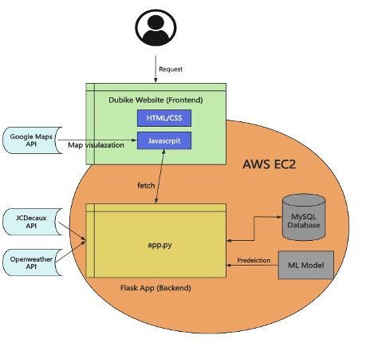

# Dublin Bike sharing Website Project - COMP30380 Software Engineering  


## Table of Contents
- [Project Overview](#project-overview)
- [Group Members](#group-members)
- [Teamwork documents](#Teamwork-documents)
- [Features](#features)
- [Technology Stack](#technology-stack)
- [Project Structure](#project-structure)
- [Installation and Setup](#installation-and-setup)
- [Usage](#usage)
- [Testing](#testing)

## Project Overview

This project is designed to provide a dynamic and interactive web application that displays real-time Dublin Bikes station occupancy information along with weather updates and predictive analytics. By integrating data from JCDecaux (DublinBikes) and OpenWeather APIs, the application provides users with a comprehensive view of bike station statuses and anticipated occupancy trends.



## Group Members

- Jian, Xinchi: [Github](https://github.com/Justetete)
- Kavanagh, Alex: [Github](https://github.com/AlexanderKav)
- Tully, Mark: [Github](https://github.com/mtully-64)

## Teamwork documents
- [Product Backlog](https://docs.google.com/spreadsheets/d/16UwcQbcadPkZ1scV0lyiCs6AiAEB3XSC/edit?usp=drive_link&ouid=112237875983919582220&rtpof=true&sd=true)
- [Prototype](https://docs.google.com/document/d/18HzMUOzncuRlrWLbt86iPlJQJVkGYof_qcaVSPj_3qQ/edit?usp=drive_link)
- [Final Report](https://docs.google.com/document/d/1rypzkfCm6ORaso-Ue8xvx0rVFUfZegF0/edit?usp=drive_link&ouid=112237875983919582220&rtpof=true&sd=true)
- Agile development sprint
  - [Sprint-1](https://drive.google.com/drive/folders/1cOePYkNI5SOnX8Wt5xpU7auCBZ7IjExV?usp=drive_link)
  - [Sprint-2](https://drive.google.com/drive/folders/1EhuQown5CMib7F2gshE2jy7KILHeMOCB?usp=drive_link)
  - [Sprint-3](https://drive.google.com/drive/folders/1oPnUb2GUzWE3CH_Oz26h06Tw-1sEMq39?usp=drive_link)
  - [Sprint-4](https://drive.google.com/drive/folders/1rfaSWSQU1ckKcTg9-zLnsermO858Qoby?usp=drive_link)

## Features

- **Interface**


- **Dynamic Data Collection:**  
  - Collects live "DublinBikes" station occupancy data from the JCDecaux API.
  - Aggregates several days of continuous histroical data for robust analytics.

- **Weather Integration:**  
  - Retrieves weather data from the OpenWeather API.
  - Displays current weather conditions and forecast for bike stations.

- **Data Management & Storage:**  
  - Stores collected data in a local MySQL database, previously an AWS RDS (code for this remains for wholeness of project).
  - Enables historical data analysis and machine learning model training.

- **Interactive Map Display:**  
  - Visualizes all Dublin Bikes stations using Google Maps API.
  - Each station is represented by a marker that can be hovered and clicked to reveal detailed station data.
  - Clicking on a station reveals current detailed occupancy bar charts and daily usage trends along with weather forecast data.

- **Predictive Analytics:**  
  - Implements a machine learning model to predict station occupancy based on historical data and weather patterns.
  - Regularly updates predictions as new data is collected.

- **Full-Stack Implementation:**  
  - Frontend developed using HTML, CSS, and JavaScript.
  - Backend API built with Python Flask, running on an EC2 instance.
  - Automated data scraping from EC2 to feed the local MySQL database.


## Technology Stack

- **Frontend:** HTML, CSS, JavaScript
- **Backend:** Python Flask (API)
- **Database:** MySQL (local, but could be hosted on Amazon RDS)
- **Cloud Infrastructure:** AWS - EC2
- **APIs:** JCDecaux API for DublinBikes data, OpenWeather API for weather information, Firebase for Authentification
- **Mapping:** Google Maps API
- **Machine Learning:** Python libraries for training and predictions

## Project Structure

```
repo/
├── app/
│   ├── app.py                  # Flask entry point
│   ├── config.json             # App configuration
│   ├── dublinbikes-firebase-config.json                  # Firebase credentials (private)
│   ├── templates/              # HTML templates
│   │   ├── index.html
│   │   ├── login.html
│   │   └── sign-up.html
│   ├── static/              # Frontend - JavaScript (auth, map, weather, etc.) & CSS
│   │   ├── imgs/
│   │   │   ├── bike-maker.png
│   │   │   └── logo2.png
│   │   ├── js/
│   │   │   ├── auth.js
│   │   │   ├── fetching_results.js
│   │   │   ├── firebase-config.js  # Firebase config settings (private)
│   │   │   ├── main.js
│   │   │   ├── map.js
│   │   │   ├── stationPlot.js
│   │   │   └── weather.js
│   │   └── styles.css
│   └── machine_learning/
│       ├── Dubike_random_forest_model.joblib
│       └── machine_learning.ipynb
├── tests/
│   ├── app/                                     # Flask API & routing tests
│   │   └── test_app.py                          # Full route coverage and session handling
│   ├── machine_learning/                        # ML model validation tests
│   │   └── test_prediction.py                   # Load, predict, handle invalid input
│   └── database/                                # Database ingestion and fallback logic
│       ├── test_jcdecaux_db.py                  # Table creation for stations & availability
│       ├── test_jcdecauxapi_to_db.py            # JCDecaux insertion into SQL
│       ├── test_jcdecauxapi_to_file.py          # JSON API Scrapping 12 hour test
│       ├── test_openweather_db.py               # Weather table SQL execution
│       ├── test_openweatherapi_to_db.py         # Weather & forecast API SQL insert logic
│       └── test_openweatherapi_to_file.py       # JSON API Scrapping 12 hour test
│   └── test_suite.py                            # Aggregates and runs all test modules
├── docs/                       # Project documentation
│   └── img/                   # Store relative pictures for the project
│       ├──Architecture.jpeg          
│       ├──Main interface.jpeg       
│       └──Project prototype.jpeg    
└── README.md

```

## Installation and Setup

1. **Clone the Repository:**
  ```bash
  git clone https://github.com/Justetete/COMP30830-SE-Group11-Dublin-Bike-Sharing-System
  cd COMP30830-SE-Group11-Dublin-Bike-Sharing-System
  ```
    
2. **Setup Virtual Environment for Python**
- Navigate to the backend folder
- Create a virtual environment and install dependencies

```bash
cd app
python -m venv venv

# Activate the virtual environment

# On Mac/Linux:
source venv/bin/activate

# On Windows:
venv\Scripts\activate

# Install dependencies
pip install -r pip_comp30830_requirements.txt
```

3. **Running the Application**
  
```python
# Code to start that Flask App
python app.py
```

- Open `http://127.0.0.1:5000` in your browser.

## Usage
- Interactive Map:
Navigate to the main page to see all Dublin Bike stations displayed on a Google Map. Selecting specific markers indicate the current bike occupancy and availability.

- Station Details:
Click on a station marker to view detailed occupancy data (hourly and daily) and the local weather forecast.

- Predictive Analytics:
Access the predictions section to see forecasted station occupancy based on the trained machine learning model.

## Testing

### Test Structure
- `tests/database/`: Unit tests for data ingestion scripts (with SQLAlchemy mocking)
- `tests/app/`: Flask app route/API tests using `unittest` and `test_client`
- `tests/machine_learning/`: Tests for the machine learning model loading, input validation, and prediction output
- `tests/test_suite.py`: Central test runner for combining all test cases

### Run All Tests
```bash
python -m tests.test_suite
```

---

## Code Coverage

To measure test coverage:

```bash
coverage run -m unittest tests.test_suite
coverage report -m
```

### Coverage Report

```
Name                                        Stmts   Miss  Cover
---------------------------------------------------------------
app/app.py                                    112     18    84%
tests/app/test_app.py                          75      0   100%
tests/database/test_jcdecaux_db.py             33      1    97%
tests/database/test_jcdecauxapi_to_db.py       41      0   100%
tests/database/test_jcdecauxapi_to_file.py     35      0   100%
tests/database/test_openweatherapi_to_db.py    38      2    95%
tests/database/test_openweatherapi_to_file.py  36      0   100%
tests/machine_learning/test_prediction.py      29      0   100%
tests/test_suite.py                            14      0   100%
---------------------------------------------------------------
TOTAL                                         413     21    92%

```

---

This application demonstrates a robust full-stack system integrating live transport data, external weather forecasting, and real-time visual analytics with cloud-based infrastructure.
